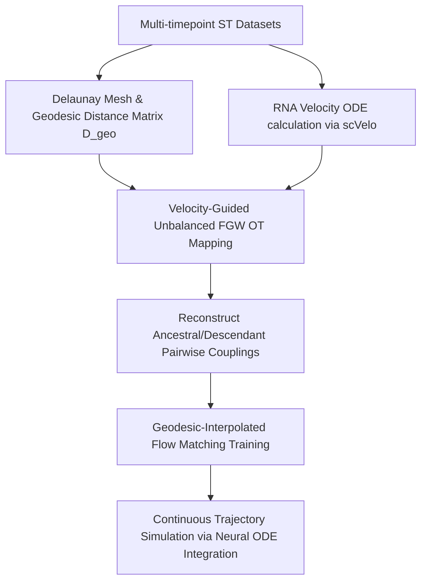

# Project 4: Spatiotemporal Lineage Tracing

## 1. Project Objectives
This project aims to reconstruct the continuous developmental and migration trajectories of cells over space and time during tissue pathogenesis (specifically, lung/liver fibrosis modeling). 

By implementing **SpaLineage-OT** (incorporating Fused Gromov-Wasserstein Optimal Transport with RNA-velocity guided drift penalties, Riemannian geodesic distance matrices, and Geodesic-Interpolated Unbalanced Schrödinger Bridge Flow Matching), we map the differentiation pathways and continuous spatial migration trajectories of cell populations around physical obstacles.

## 2. Technical Workflow
The system pipeline consists of the following steps:



### Step 1: Preprocessing & Manifold Geometry Construction
- Compile spatial transcriptomics datasets across different time points of tissue pathogenesis (e.g., Days 0, 3, 7, 14 post-bleomycin).
- Build Delaunay triangulation graphs on cell spatial coordinates and compute shortest-path geodesic distance matrices ($D^{geo}$) on a Riemannian manifold parameterized by morphological tissue impedance.

### Step 2: Velocity-Guided Unbalanced Optimal Transport (U-FGW)
- Formulate cell transitions between time point $t$ and $t+1$ as an Unbalanced Fused Gromov-Wasserstein problem.
- Construct asymmetric cost matrices ($C^{VG}_{expr}$) guided by transcription-space RNA velocity vectors, enforcing directionality and developmental hierarchy.

### Step 3: Continuous Schrödinger Bridge Flow Matching (GI-USBFM)
- Draw matched start-end cell pairs from the solved coupling plan.
- Construct spatial interpolation paths along the computed geodesic curves rather than straight lines.
- Train a neural drift field $u_\theta(\mathbf{s}, t)$ on the geodesic tangent vectors to natively learn obstacle-avoiding continuous trajectories.
- Integrate trajectories using a Runge-Kutta 4th order (RK4) solver for high-fidelity continuous path visualization.

## 3. System Architecture & Folder Structure
```
project_4_Spatiotemporal_Lineage/
├── README.md                  # Project overview and workflow (this file)
├── literature_search.md       # Relevant papers and theoretical backing
├── data_collection_checklist.md # Specific datasets and download protocols
├── src/
│   ├── velocity_ode.py        # Compute RNA velocity vectors
│   ├── moscot_ot.py           # Solve spatiotemporal OT problem
│   ├── lineage_trace.py       # Extract lineage trajectories and migration paths
│   └── visualize_path.py      # Plot trajectories over tissue morphology
└── config/
    └── moscot_config.yaml     # OT regularization weight and iteration params
```
