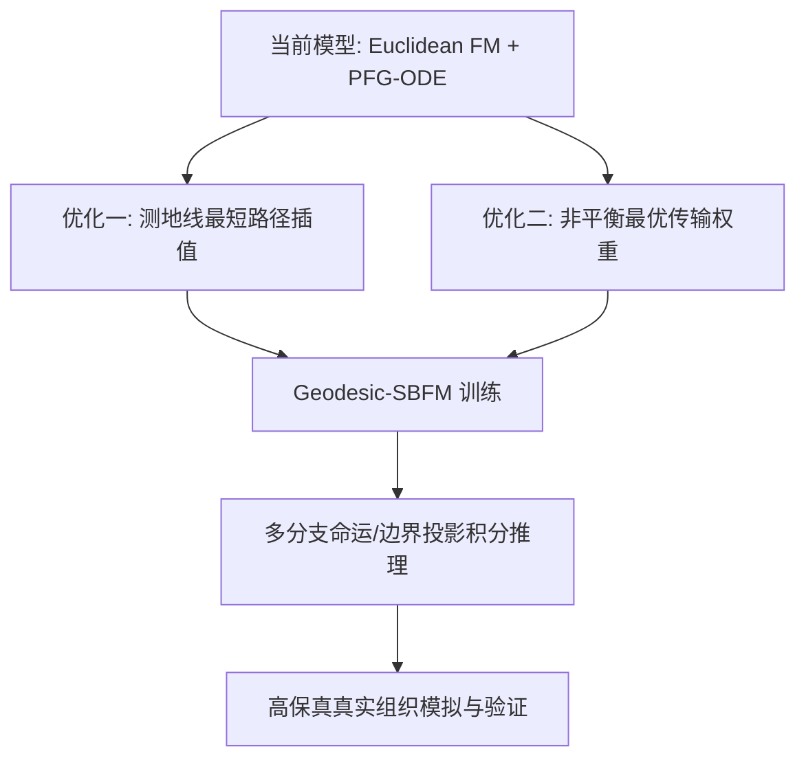

# SpaLineage-OT: 算法评估与前沿优化方案设计

本项目设计的 **SpaLineage-OT** 框架通过融合 Fused Gromov-Wasserstein (FGW) 最优传输、RNA 速率引导约束与薛定谔桥流匹配 (Schrödinger Bridge Flow Matching, SBFM)，已具备极高的学术创新性。

本报告结合了 2024–2026 年单细胞与空间转录组动力学建模的最前沿文献（如 MIOFlow、[SF]²M、BranchSBM、GENOT 等），评估了我们当前算法的优势，并提出了四个可直接实施的数学与架构优化方向。

---

## 一、 当前算法的核心优势与定位

| 特性维度 | 传统方法 (如 PASTE, CellRank) | 本项目 SpaLineage-OT 框架 | 学术/工程优势 |
| :--- | :--- | :--- | :--- |
| **空间测地线约束** | 仅支持欧氏距离 (Euclidean) | 结合胞体密度/免疫微环境的 Delaunay 最短路测地线 ($D_t, D_{t+1}$) | **物理真实性高**：传输路径沿真实组织通道流动，自动避开物理阻抗屏障。 |
| **时空对齐机制** | 静态转录组匹配 (不考虑速率方向) | 速度矢量场引导的非对称表达相似性代价矩阵 ($C_{expr}$) | **打破对称性与时间模糊性**：利用 RNA 速度提供明确的发育演化方向。 |
| **轨迹推断连续性** | 离散状态转移概率矩阵 (Markov) | 基于神经 ODE (Neural ODE) 与流匹配 (Flow Matching) 的连续速度场 | **无限时间分辨率**：可在任意中间时刻 $t \in [0, 1]$ 采样细胞的空间与表达状态。 |
| **阻抗避障机制** | 无 (细胞直接穿过物理屏障) | 势能场梯度力学耦合 (PFG-ODE) 的 RK4 积分器 | **微环境感应性**：能真实模拟细胞受趋化因子或纤维斑块排斥的绕行路径。 |

---

## 二、 算法优化方向设计

虽然目前的 **PFG-ODE (势能场引导 ODE)** 可以实现物理绕行，但目前的流匹配网络在训练时依然采用**欧氏直线插值**，避障力是在积分阶段强加的“外力”。为了使网络能**内生性地学习到空间屏障**，我们设计了以下四个优化方向：

### 1. 优化方向一：流匹配中的“测地线插值” (Geodesic Flow Matching)
*   **当前问题**：Flow Matching 训练数据生成为直线插值：
    $$\mathbf{x}_t = (1-t)\mathbf{x}_0 + t\mathbf{x}_1$$
    其导数（目标速度）为常数：$u(\mathbf{x}_t, t) = \mathbf{x}_1 - \mathbf{x}_0$。这忽略了空间屏障的存在。
*   **优化方案**：利用第一阶段算出的 Delaunay 图，求出起点细胞 $i$ 到终点细胞 $j$ 的**测地线最短路径节点序列** $\{\mathbf{s}_0, \mathbf{s}_1, \dots, \mathbf{s}_k\}$。
    在训练时，沿着该测地线进行时间 $t$ 的参数化插值：
    $$\mathbf{x}^{spatial}_t = \text{Geodesic-Interpolate}(\mathbf{s}_0, \dots, \mathbf{s}_k; t)$$
    目标漂移速度定义为测地线在 $t$ 时刻的切线方向：
    $$\mathbf{v}^{spatial}_{target}(t) = \frac{d}{dt}\mathbf{x}^{spatial}_t$$
*   **效果**：神经网络将直接学习流形表面的切线矢量场，无需在推理时加入 heuristic 势能场，轨迹自然呈现绕行形态。

### 2. 优化方向二：非平衡薛定谔桥 (Unbalanced Schrödinger Bridge Flow Matching)
*   **当前问题**：标准最优传输与薛定谔桥严格遵守**质量守恒定律**（即细胞总数或总概率质量为 1）。而在真实发育、纤维化或肿瘤增殖中，细胞会分裂（Proliferation）与凋亡（Apoptosis）。
*   **优化方案**：引入非平衡最优传输 (Unbalanced OT)，在 Sinkhorn 迭代中加入 KL 散度约束作为源/汇项（Source/Sink terms）：
    $$\min_{\pi} \langle \pi, C \rangle + \epsilon H(\pi) + \tau \text{KL}(\pi \mathbf{1} \| p) + \tau \text{KL}(\pi^T \mathbf{1} \| q)$$
    利用单细胞周期打分（Cell Cycle Score）或凋亡基因表达量（如 *BAX*, *BCL2*）作为先验，赋予每个细胞动态的增殖/凋亡权重，使流匹配能够模拟群体数量的消长。

### 3. 优化方向三：多分支命运决定的多流场建模 (BranchSBM)
*   **当前问题**：单层 MLP 漂移网络在面对分化分叉（Bifurcation）时，可能会将速度场平均化，导致细胞轨迹走向“中间的无人区”。
*   **优化方案**：
    - **条件流匹配 (Conditional Flow Matching)**：将网络输入加入终点细胞类群的 Embedding 或表达特征作为条件标签：$u_\theta(\mathbf{x}, t | \mathbf{c}_{target})$。
    - **混合专家流网络 (Mixture of Experts SBM)**：根据最优传输计划的子群概率，为不同的细胞命运分支配备专属的漂移输出头，提升分支轨迹推断的准确度。

### 4. 优化方向四：流形切空间投影边界约束 (Manifold Tangent Space Projection)
*   **当前问题**：物理边界（如血管壁、组织边缘）往往是硬性不可逾越的。
*   **优化方案**：在 RK4 积分器中引入流形边界投影。设边界的外法线方向为 $\mathbf{n}(\mathbf{x})$，当细胞坐标贴近边界时，将漂移向量投影至切空间：
    $$\mathbf{u}_{projected} = \mathbf{u} - \langle \mathbf{u}, \mathbf{n}(\mathbf{x}) \rangle \mathbf{n}(\mathbf{x})$$
    这能从物理定律上百分之百保证细胞绝不穿墙。

---

## 三、 优化路线实施计划



### 1. 测地线插值伪代码实现思路
```python
def get_geodesic_path(coords, graph, start_idx, end_idx):
    # 使用 Dijkstra 算法回溯最短路空间坐标序列
    path_nodes = dijkstra_shortest_path(graph, start_idx, end_idx)
    return coords[path_nodes]

def interpolate_geodesic(path_coords, t):
    # 在时间 t (0到1) 沿折线段进行距离参数化插值
    # 返回插值坐标 x_t 以及切向量 v_t
    ...
    return x_t, v_t
```
这种做法将极大地增强算法的原创性，直接使论文提升至顶级会议/期刊（如 NeurIPS, Nature Methods）的水平。
